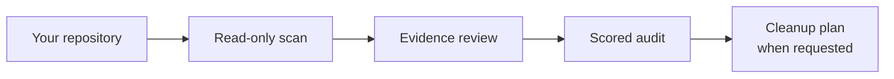

<div align="center">

# woekel works

**Less manual checking. Fewer loose ends. More room for the work that matters.**

Reusable Claude Code and Codex skills I build and run to make operations feel
lighter and reduce the need to remember every next step.

[](LICENSE)
[](https://www.python.org/)
[](skills/repo-structure-audit/tests/)

</div>

## Skills

[**Repo Structure Audit**](skills/repo-structure-audit/). Use it
when a repository feels hard to navigate, full of duplicates, or risky to reorganize.
It reads your repo, scores it against ten principles, and proposes the safest
cleanup. It never moves or deletes anything.

[**Review Critically**](skills/review-critically/). Use it when a plan, document,
design, or workflow needs a skeptical second opinion. It reconstructs the real
problem, separates evidence from inference, checks relevant external guidance, and
ranks the gaps that matter. It stays read-only unless you separately request changes.

## The structure audit model

To get value from the audit, you need its way of thinking. Here is the whole model in
four ideas.

### 1. Every fact has exactly one home

A fact is anything that can be true or false: a rule, a setting, a status, a decision.
It lives in one file. Every other file links there instead of repeating it. If you
must edit two files to keep one statement true, that statement has two homes, and one
of them is already drifting.

### 2. Files have jobs, not just types

| Kind | Job | Holds facts? | Examples |
|---|---|---|---|
| **Owner** | States a fact and keeps it correct | Yes | `STATUS.md`, `config.json`, code |
| **Router** | Points an agent to the right owner | No, only paths | `AGENTS.md`, `CLAUDE.md` |
| **Orientation** | Explains the repo to a person | Summary only | `README.md` |

Routers hold zero facts. A README is never a router and never the source of truth.

### 3. Ask five questions before placing anything

Who owns it? What job does it do? Who reads it? What authority does it have? What
lifecycle is it in? The answers decide the folder. The root is a map, not a drawer.

### 4. Active, generated, historical, and disposable must look different

If a machine can rebuild it, ignore it or mark it. If it was replaced, say so and keep
it findable. If it stopped being maintained, say that too. Cleanup should never be a
guess.

The audit turns these four ideas into ten scored principles, grouped as Navigability,
Ownership, Lifecycle, and Hygiene. The full lesson, the principle table, and what the
report looks like are in the
[skill README](skills/repo-structure-audit/README.md).

## How it works



The scanner collects facts. The skill checks those facts against your repo's actual
purpose and conventions before it recommends anything. A notes-only repo is never
told to add `src/` and `tests/`.

## Install

Clone this repository, then copy the skill you want into the tool you use:

```bash
git clone https://github.com/kwoekel/woekel-works.git

# Claude Code (replace <skill-name> with repo-structure-audit or review-critically)
cp -R woekel-works/skills/<skill-name> ~/.claude/skills/

# Codex
cp -R woekel-works/skills/<skill-name> ~/.codex/skills/
```

Then ask in plain words: "Audit this repository's structure" or "Review this
plan critically."

Git is needed to clone the repository. Repo Structure Audit also needs Python 3;
its scanner uses only the standard library. Review Critically has no extra runtime
dependencies.

## Why I built it

Good operations should make work easier to carry, not add another system to
remember. I build these tools for my own operating system first, then share the
parts that can help someone else work with less friction.

I'm Kierra Woekel. I bring 10+ years across marketing operations, strategic
partnerships, and community engagement to AI systems built for real business
operations.

## License

MIT — use it, adapt it, and ship what helps.
